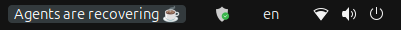
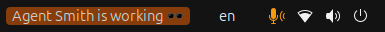
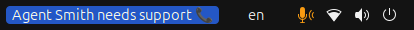
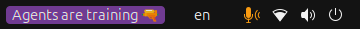
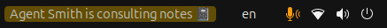
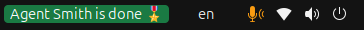
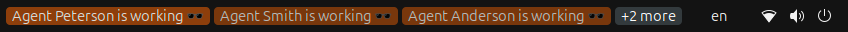
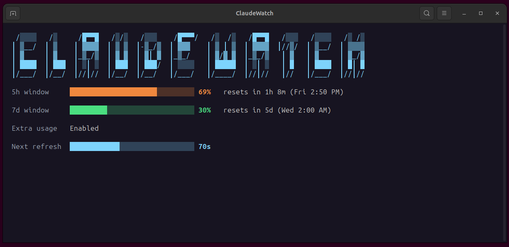

<div align="center">
# ClaudeWatch

**Live Claude Code activity, right in your GNOME top panel.**

[](LICENSE)


</div>

```text
 /░░░░   /░     /█▀▀█   /░/░   /░░░    /█▀▀▀/   /░  /░   /█▀▀█   /░░░   /░░░░   /░ /░
│ ▒__/  │ ▒    │ ▓▓▓▓  │ ▒ ▒  │-▒_/▒  │ ▓▓▓    │ ▒ │ ▒  │ ▓▓▓▓  │//▒/  │ ▒__/  │ ▒▒▒▒
│ ▓     │ ▓    │_▒_/▒  │ ▓ ▓  │ ▓│ ▓  │_▒_/    │ ▓/▓ ▓  │_▒_/▒   │ ▓   │ ▓     │ ▓_/▓
│ ████  │ ███  │ ░│ ░  │ ███  │ ███/  │ ░░░░   │ █████  │ ░│ ░   │ █   │ ████  │ █│ █
│/___/  │/__/  │//│//  │/__/  │/__/   │/___/   │/____/  │//│//   │//   │/___/  │//│//
```

## Contents

- [What it does](#what-it-does)
- [Panel states](#panel-states)
- [Claude Usage (the terminal rate-limit view)](#claude-usage-the-terminal-rate-limit-view)
- [Status: alpha, not published](#status-alpha-not-published)
- [Installation](#installation)
- [Development](#development)
- [Docs](#docs)
- [License](#license)

## What it does

ClaudeWatch is a GNOME Shell extension that turns Claude Code's hook events
into a live panel indicator: one label per running Claude Code session,
updated in real time as it works, waits on you, compacts, or finishes. No
more alt-tabbing to a terminal just to check whether an agent is still going
or stuck on a permission prompt.

- **One label per session** — concurrent sessions are never collapsed into a
  single aggregate icon; a session waiting on you always stays visible.
- **Six-state lifecycle** — running, waiting, compacting, consulting,
  complete, standby. See [Panel states](#panel-states) below.
- **Works everywhere Claude Code runs locally** — the CLI, the official VS
  Code extension, and Claude Desktop's Code tab.
- **Optional Claude Usage view** — a live, auto-refreshing 5h/7d rate-limit
  terminal view. Opt-in and off by default.
- **Local-only** — no telemetry, no network calls, except the one opt-in
  usage check above, which you have to enable yourself.

## Panel states

Each live Claude Code session gets its own panel label, cycling through
these states (full state-machine details in
[docs/ARCHITECTURE.md](docs/ARCHITECTURE.md#session-lifecycle--state-machine)):

| State         | Color  | Example label                        | When                                                           |
| ------------- | ------ | ------------------------------------ | -------------------------------------------------------------- |
| 🟠 running    | orange | "Agent Smith is working 🕶️"          | a tool call or turn is in flight                               |
| 🔵 waiting    | blue   | "Agent Smith needs support 📞"       | paused on a permission prompt or a question — needs you        |
| 🟣 compacting | purple | "Agents are training 🔫"             | a manual `/compact` is in progress                             |
| 🟡 consulting | olive  | "Agent Smith is consulting notes 📓" | the turn ended but a spawned subagent hasn't reported back yet |
| 🟢 complete   | green  | "Agent Smith is done 🎖️"             | just finished — flashes for 5s, then the label disappears      |
| ⚪ standby    | grey   | "Agents are recovering ☕"           | no session is live                                             |

### Multiple concurrent agents

Every live session is tracked independently — its own state file, its own
panel label, its own agent name (picked once per session, avoiding
collisions with other concurrently-live sessions). Panel space is capped:
only the first 3 sessions get an inline label, and the rest collapse into a
single "+N more" chip, so a wall of terminals never floods the top panel.

### Works with the CLI, VS Code, and Claude Desktop

ClaudeWatch never distinguishes _how_ Claude Code was launched — hooks are
configured once, globally, in `~/.claude/settings.json`, and the CLI, the
official VS Code extension, and Claude Desktop's Code tab all share that same
settings file. Any locally-executing session is visible to ClaudeWatch
regardless of surface, with no surface-specific code. This does **not**
extend to sessions where the engine itself runs on a different machine —
Desktop's Remote/SSH/Cloud environments and cloud-run background agents fire
their hook commands on that other host, so no local state file is ever
written here.

Verified directly on all three locally-executing surfaces — **only on
Ubuntu 24.04** (24.04.4). Other GNOME 46 distros likely work but haven't been
tested.

### What it looks like

<table>
<tr>
<td align="center" width="25%"><br><sub>Standby — no live sessions</sub></td>
<td align="center" width="25%"><br><sub>Running</sub></td>
<td align="center" width="25%"><br><sub>Waiting</sub></td>
<td align="center" width="25%"><br><sub>Compacting</sub></td>
</tr>
<tr>
<td align="center" width="25%"><br><sub>Consulting</sub></td>
<td align="center" width="25%"><br><sub>Complete</sub></td>
<td align="center" width="50%" colspan="2"><br><sub>Multiple concurrent agents, capped inline plus the overflow chip</sub></td>
</tr>
</table>

## Claude Usage (the terminal rate-limit view)

Click **Show usage** in the popup menu for a live, auto-refreshing terminal
view of your 5-hour and 7-day Claude usage windows — it hits the dedicated
account-status endpoint, not a Messages completion, so checking costs no API
quota. Opt-in only: it does nothing until you point it at a token yourself
(see [Step 5](#5-optional--the-claude-usage-rate-limit-check) below).

<p align="center">

</p>

## Status: alpha, not published

**ClaudeWatch is alpha software and isn't published anywhere** — not on
GNOME Extensions (EGO), no installer, no release tarball. There's also no
setup wizard yet (see [docs/ROADMAP.md](docs/ROADMAP.md)); the
[Installation](#installation) section below is what that wizard would
eventually automate, done entirely by hand for now. If you want to run it
today, you need to clone this repo and build it yourself.

## Installation

### Prerequisites

- **GNOME Shell 46** (`gnome-shell --version`) — the UUID's `shell-version`
  in [`extension/metadata.json`](extension/metadata.json).
- **Claude Code**, installed and run at least once interactively (a plain
  `claude` login, not just `claude setup-token`). This is what creates
  `~/.claude/settings.json` (Step 3 writes into it) and, if you want the
  optional Claude Usage row (Step 5), `~/.claude/.credentials.json`.
- **Node.js on `PATH`** — the hook handler is a `node` script. Claude Code
  already requires Node to run at all, so if `claude` works, this is already
  satisfied.

### 1. Clone and build

```sh
git clone git@github.com:yevhen-chernenko/claudewatch.git
cd claudewatch
npm install
npm run build
```

This compiles `src/` into `dist/` (gitignored). Two things come out of it
that the next two steps depend on: `dist/extension/` (the GNOME extension
itself) and `dist/hooks/hook-handler.js` (what Claude Code will invoke — note
its absolute path on your machine, Step 3 needs it verbatim).

### 2. Install the GNOME extension

```sh
ln -s "$PWD/dist/extension" ~/.local/share/gnome-shell/extensions/claudewatch@yevhen-chernenko.github.io
gnome-extensions enable claudewatch@yevhen-chernenko.github.io
```

Reload the shell so it picks up the new symlink (X11: Alt+F2, `r`, Enter;
Wayland: log out and back in). You should see a single "Agents are
recovering ☕" label appear in the top panel — that's the extension running
with zero live sessions, not a sign anything is broken.

### 3. Wire up Claude Code's hooks (the Claude-side setup)

This is the step with no automation yet, and the one most likely to be
skipped silently: without it, the panel sits on "Agents are recovering ☕"
forever, no matter what you do in Claude Code, because Claude Code never
tells the hook handler anything happened.

Open `~/.claude/settings.json` (create it if it doesn't exist) and merge
these entries into its top-level `hooks` object — **merge, don't overwrite**;
if you already have other hooks configured, add to the arrays rather than
replacing them. Replace `/absolute/path/to/claudewatch` with the path from
Step 1:

<details>
<summary><strong>Full <code>hooks</code> block to merge into <code>~/.claude/settings.json</code></strong></summary>

```jsonc
{
  "hooks": {
    "UserPromptSubmit": [
      {
        "hooks": [
          {
            "type": "command",
            "command": "node",
            "args": [
              "/absolute/path/to/claudewatch/dist/hooks/hook-handler.js",
            ],
            "async": true,
          },
        ],
      },
    ],
    "PreToolUse": [
      {
        "hooks": [
          {
            "type": "command",
            "command": "node",
            "args": [
              "/absolute/path/to/claudewatch/dist/hooks/hook-handler.js",
            ],
            "async": true,
          },
        ],
      },
    ],
    "PostToolUse": [
      {
        "hooks": [
          {
            "type": "command",
            "command": "node",
            "args": [
              "/absolute/path/to/claudewatch/dist/hooks/hook-handler.js",
            ],
            "async": true,
          },
        ],
      },
    ],
    "PreCompact": [
      {
        "hooks": [
          {
            "type": "command",
            "command": "node",
            "args": [
              "/absolute/path/to/claudewatch/dist/hooks/hook-handler.js",
            ],
            "async": true,
          },
        ],
      },
    ],
    "PostCompact": [
      {
        "hooks": [
          {
            "type": "command",
            "command": "node",
            "args": [
              "/absolute/path/to/claudewatch/dist/hooks/hook-handler.js",
            ],
            "async": true,
          },
        ],
      },
    ],
    "PermissionRequest": [
      {
        "hooks": [
          {
            "type": "command",
            "command": "node",
            "args": [
              "/absolute/path/to/claudewatch/dist/hooks/hook-handler.js",
            ],
            "async": true,
          },
        ],
      },
    ],
    "Notification": [
      {
        "hooks": [
          {
            "type": "command",
            "command": "node",
            "args": [
              "/absolute/path/to/claudewatch/dist/hooks/hook-handler.js",
            ],
            "async": true,
          },
        ],
      },
    ],
    "Stop": [
      {
        "hooks": [
          {
            "type": "command",
            "command": "node",
            "args": [
              "/absolute/path/to/claudewatch/dist/hooks/hook-handler.js",
            ],
            "async": true,
          },
        ],
      },
    ],
    "SubagentStart": [
      {
        "hooks": [
          {
            "type": "command",
            "command": "node",
            "args": [
              "/absolute/path/to/claudewatch/dist/hooks/hook-handler.js",
            ],
            "async": true,
          },
        ],
      },
    ],
    "SubagentStop": [
      {
        "hooks": [
          {
            "type": "command",
            "command": "node",
            "args": [
              "/absolute/path/to/claudewatch/dist/hooks/hook-handler.js",
            ],
            "async": true,
          },
        ],
      },
    ],
    "SessionEnd": [
      {
        "hooks": [
          {
            "type": "command",
            "command": "node",
            "args": [
              "/absolute/path/to/claudewatch/dist/hooks/hook-handler.js",
            ],
            "async": true,
          },
        ],
      },
    ],
  },
}
```

</details>

That's the complete event set the hook handler understands — omitting one
just means that transition never shows up in the panel. A few aren't
independent, though:

- **`PreCompact`/`PostCompact`** install as a pair. Skip `PreCompact` alone
  and a manual `/compact` shows "training" but never leaves it except via a
  slower fallback; skip both together if you just don't care about seeing
  that state at all.
- **`SubagentStart`/`SubagentStop`** install as a pair too. Skipping them
  means a session that backgrounds a subagent call and stops its visible
  turn while the subagent is still working flashes "done" early instead of
  showing "consulting".
- **`SessionEnd`** matters most of all to not skip — without it, session
  state files are only cleaned up by slower fallback GC instead of
  immediately.

No restart of Claude Code is needed — hooks are read per-invocation, so the
very next prompt you send in any session picks this up.

### 4. Verify

Fastest check, no real Claude Code session needed:

```sh
echo '{"hook_event_name":"UserPromptSubmit","session_id":"smoke-test"}' \
  | node /absolute/path/to/claudewatch/dist/hooks/hook-handler.js
```

The panel should switch to "Agent `<name>` is working 🕶️" within about a
second. Clean up with:

```sh
echo '{"hook_event_name":"SessionEnd","session_id":"smoke-test"}' \
  | node /absolute/path/to/claudewatch/dist/hooks/hook-handler.js
```

Then confirm it end-to-end: open a real Claude Code session — CLI, VS Code
extension, or Desktop app's Code tab all work identically — and send a
prompt. If the panel never moves, see
[SETUP.md's Troubleshooting](docs/SETUP.md#troubleshooting).

### 5. Optional — the Claude Usage rate-limit check

Skip this if you don't care about the 5h/7d usage percentages — nothing else
in the extension depends on it. It's opt-in by design: the extension never
creates this file itself.

```sh
mkdir -p ~/.config/claudewatch
ln -s ~/.claude/.credentials.json ~/.config/claudewatch/token
```

Then click "Show usage" in the popup menu. It additionally needs **Python
3** (stdlib only) and **a terminal emulator on `PATH`** (`gnome-terminal`/GNOME
Console already satisfy this on stock GNOME). Full details on why the token
must be this specific file, and what each error message means, are in
[EXTENSION.md](docs/EXTENSION.md#setting-up-the-claude-usage-token).

---

For the fully detailed, start-to-finish walkthrough — including
troubleshooting for every step above — see
[docs/SETUP.md](docs/SETUP.md).

## Development

Written in TypeScript; `npm run build` compiles `src/` to `dist/`, which is
what actually runs (both the GNOME extension and the hook handler). See
[docs/EXTENSION.md](docs/EXTENSION.md#building) for the build step and
[docs/TESTING.md](docs/TESTING.md) for how to exercise it by hand.

```sh
npm install
npm run build
npm run typecheck   # type-check only, no output
npm test            # vitest, the pure-logic coverage
```

## Docs

| Doc                                     | What's in it                                                                       |
| --------------------------------------- | ---------------------------------------------------------------------------------- |
| [SETUP.md](docs/SETUP.md)               | The complete first-time setup walkthrough, plus troubleshooting                    |
| [ARCHITECTURE.md](docs/ARCHITECTURE.md) | Full technical design: components, the session state file, the state machine       |
| [EXTENSION.md](docs/EXTENSION.md)       | As-built extension internals: file layout, popup menu, the Claude Usage token      |
| [TESTING.md](docs/TESTING.md)           | Manual test scripts and the dev preview menu for driving every panel state by hand |
| [SECURITY.md](docs/SECURITY.md)         | Threat model, the GNOME review checklist, opt-in network egress                    |
| [ROADMAP.md](docs/ROADMAP.md)           | Phased plan: Alpha (current) → Beta → ongoing open source                          |
| [BACKLOG.md](docs/BACKLOG.md)           | Concrete wishlist and bug tracker                                                  |

## License

[GPL-2.0-or-later](LICENSE)
